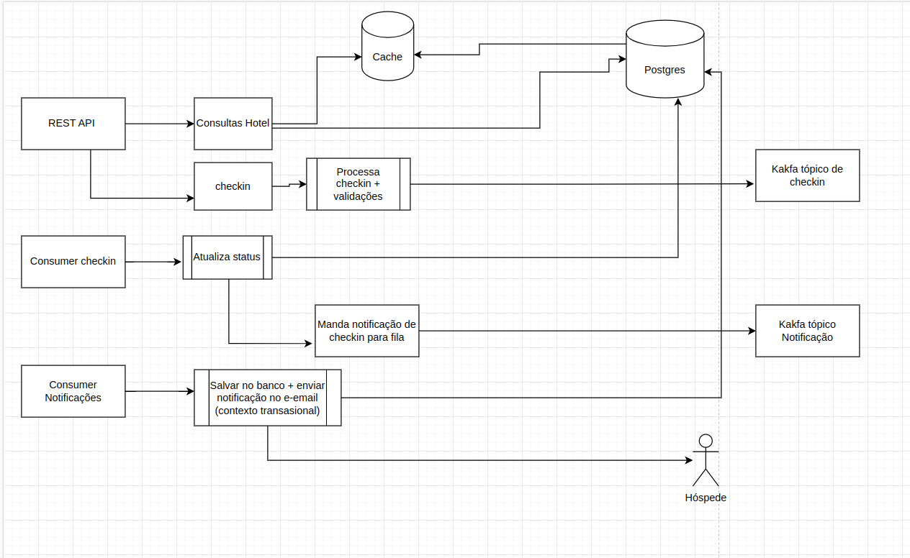
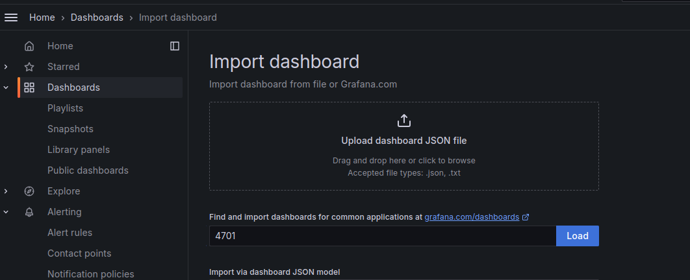
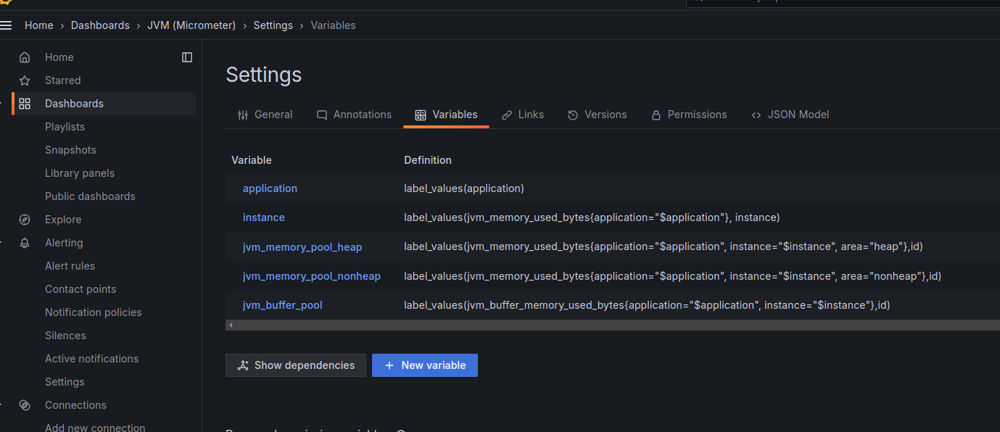
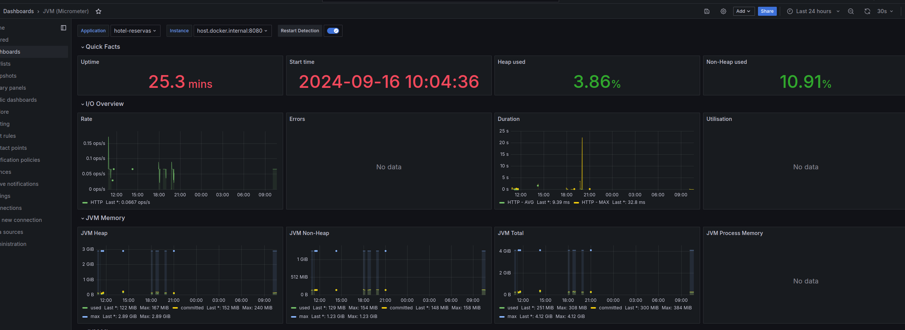
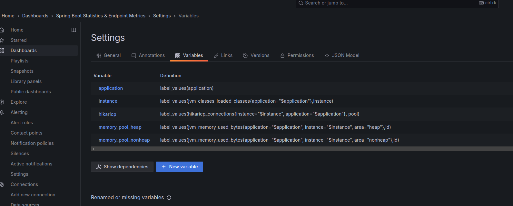
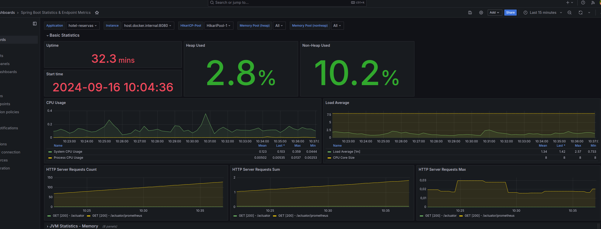

# Sistema de Reservas de Hotéis

## Visão Geral do Projeto
Este projeto é um **Sistema de Reservas de Hotéis** desenvolvido como parte de um desafio técnico. O objetivo principal foi criar uma aplicação escalável, resiliente e de alta performance para realizar buscas, comparações e reservas de hotéis, além de gerenciar as reservas de forma eficiente. O sistema foi construído utilizando **Java 21** e **Spring Boot 3.3.3**, integrando várias tecnologias como **PostgreSQL**, **Redis**, **Kafka**, **Prometheus**, **Grafana** e **Loki** para cache, mensagens assíncronas, monitoramento e logging.

## Diagrama Arquiterua (Fluxo geral)



## Arquitetura e Tecnologias Utilizadas

### Banco de Dados: PostgreSQL
Optei por utilizar o **PostgreSQL** como banco de dados relacional. Embora o **MongoDB** seja mais performático para algumas operações, o PostgreSQL oferece suporte nativo à replicação síncrona, garantindo **consistência ACID**. Isso foi crucial para manter a integridade dos dados nas operações críticas, como reservas e atualizações de status. Além disso, o PostgreSQL escala horizontalmente, o que o torna adequado para sistemas com alta demanda, mesmo que não seja tão rápido quanto o MongoDB em certas operações.

### Cache: Redis
Implementei o **Redis** como um cache distribuído para reduzir a carga no banco de dados, melhorando o desempenho nas consultas mais frequentes, como detalhes de hotéis e busca por cidade. O cache foi configurado para armazenar dados em memória, garantindo uma resposta rápida para as operações que demandam muita leitura.

### Mensageria: Kafka
O **Kafka** foi utilizado para enfileirar e processar as mensagens relacionadas a eventos de criação, confirmação, check-in e check-out de reservas. Isso permitiu que as operações fossem processadas de forma assíncrona, aumentando a capacidade de resposta do sistema sem sobrecarregar as requisições. Além disso, os consumidores Kafka foram configurados para tratar as mensagens em tempo real e realizar as operações necessárias no backend.

### Monitoramento e Logs: Prometheus, Grafana e Loki
- **Prometheus**: Utilizado para coletar métricas da aplicação, permitindo o monitoramento em tempo real da performance do sistema.
- **Grafana**: Integrado com o Prometheus e Loki, o Grafana foi configurado como a ferramenta de visualização de dados, onde é possível acompanhar métricas e logs em dashboards personalizados.
- **Loki**: Responsável por centralizar os logs da aplicação, facilitando a análise e a depuração. Foi configurado para coletar logs de diversas partes do sistema e integrá-los com o Grafana para exibição.

## Estrutura de Código e Funcionalidades

### Índices no Banco de Dados
Criei **índices** nos campos de cidade, estado e preço por noite na entidade `Hotel` para otimizar as consultas mais frequentes e melhorar o desempenho. Os índices ajudam a acelerar buscas que envolvem a localização e o preço dos hotéis, tornando o sistema mais eficiente sob alta carga.

```java
@Entity
@Table(name = "hotel", indexes = {
    @Index(name = "idx_estado_cidade", columnList = "estado, cidade"),
    @Index(name = "idx_preco_por_noite", columnList = "preco_por_noite")
})
public class Hotel { 
    // Código da entidade Hotel 
}
```

### Exceções Personalizadas
Implementei exceções customizadas e um **Exception Handler** global para fornecer mensagens de erro mais claras e padronizadas para os clientes da API, além de facilitar o debug em caso de falhas.

### Docker Compose

Para rodar a aplicação localmente, utilize o Docker Compose. Na raiz do projeto, execute o comando:

```bash
docker-compose up -d
```

### Exemplo de Dashboards Importados

Importei dois dashboards no Grafana: o **4701** e o **14430**. Eles fornecem visualizações detalhadas das métricas e logs da aplicação.

  <!-- Substitua "caminho/para/imagem.png" pelo caminho real da imagem -->

Para que o dashboard do micrometer funcione a config das variáveis deve estar conforme na imagem abaixo
### Config Dashboard Micrometer


### Dashboard Micrometer


### Config Dashboard Metricas Spring


### Dashboard Metricas Spring


### Gerando Gráficos no Grafana

No Grafana, você pode criar e visualizar gráficos e dashboards personalizados para monitorar e analisar suas métricas. Para isso, você pode importar dashboards pré-configurados que fornecem visualizações detalhadas e prontas para uso. Aqui está como você pode fazer isso:

1. **Acessar o Grafana**:
    - Abra seu navegador e acesse o Grafana usando o endereço `http://localhost:3000`.
    - Faça login com as credenciais configuradas (usuário e senha padrão são geralmente `admin`).

2. **Importar Dashboards**:
    - No painel principal do Grafana, clique no ícone de **"+"** no menu lateral esquerdo e selecione **"Importar"**.
    - Você verá uma página para importar dashboards.

3. **Importar o Dashboard**:
    - **Importar pelo ID**: Se você tiver o ID do dashboard, como os IDs **4701** e **14430**, basta inseri-los no campo **"Importar via ID"** e clicar em **"Carregar"**. O Grafana buscará automaticamente o dashboard associado ao ID fornecido e o carregará para você.
    - **Importar Arquivo JSON**: Se você tem um arquivo JSON do dashboard, clique em **"Escolher Arquivo"** e selecione o arquivo JSON do seu computador. Em seguida, clique em **"Carregar"**.

4. **Configurar o Dashboard**:
    - Após o dashboard ser importado, você pode precisar configurar a fonte de dados. Selecione a fonte de dados apropriada (por exemplo, **Prometheus** para métricas) e clique em **"Salvar e Aplicar"**.

5. **Visualizar e Personalizar**:
    - Uma vez que o dashboard estiver importado, você poderá visualizar os gráficos e métricas conforme definido. Você pode personalizar os gráficos, adicionar novos painéis e ajustar os filtros conforme necessário.

6. **Salvar o Dashboard**:
    - Após configurar e personalizar o dashboard, clique no ícone de **disquete** no canto superior direito para salvar as alterações e dar um nome ao dashboard.

Os dashboards importados fornecem uma visão rápida e compreensiva das métricas da aplicação e são extremamente úteis para monitorar a performance e a saúde do sistema.

### O que eu faria se tivesse mais tempo?

Devido a questões de tempo e custo, não implementei alguns aspectos avançados na AWS para este projeto. No entanto, se tivesse mais tempo e fosse um projeto real, aqui estão algumas melhorias e implementações que eu consideraria:

1. **Deploy na AWS com Elastic Beanstalk**:
    - Implementaria o deploy da aplicação na AWS utilizando o **AWS Elastic Beanstalk**. Essa plataforma facilita o gerenciamento da aplicação, incluindo o provisionamento de recursos, monitoramento e escalabilidade.
    - **Elastic Beanstalk** permitiria gerenciar facilmente o ambiente da aplicação, oferecendo suporte para balanceamento de carga e gerenciamento de instâncias, sem precisar configurar manualmente a infraestrutura subjacente.

2. **Auto-Scaling**:
    - Configuraria o **auto-scaling** para a aplicação. Isso garantiria que a aplicação possa escalar automaticamente em resposta a mudanças na carga de trabalho, aumentando ou diminuindo o número de instâncias conforme a demanda.
    - O auto-scaling ajudaria a manter a performance da aplicação e a reduzir os custos operacionais, ajustando os recursos de forma dinâmica.

3. **Replicação de Banco de Dados**:
    - Criaria a configuração para **réplicas do banco de dados** no PostgreSQL. A replicação de banco de dados garantiria alta disponibilidade e redundância, permitindo que o sistema continue funcionando mesmo em caso de falha em uma das instâncias.
    - Isso também ajudaria a distribuir a carga de leitura e melhorar a performance geral do banco de dados.

4. **Divisão em Microserviços**:
    - Caso a aplicação precisasse escalar muito, dividiria a aplicação em **microserviços**. Por exemplo, poderia criar um microserviço dedicado para a busca e comparação de hotéis e outro para o gerenciamento de reservas.
    - Essa abordagem permitiria escalar separadamente diferentes partes da aplicação, conforme as necessidades específicas de cada serviço. Isso proporcionaria uma arquitetura mais flexível e escalável, além de melhorar a manutenibilidade e o isolamento de falhas.

5. **Infraestrutura Como Código**:
    - Para um melhor controle sobre o provisionamento da infraestrutura, optaria pela da criação da infra via terraform automatizando toda criação dos recursos tendo tanto o versionamento de tudo como também um histórico da evolução da infraestrutura do projeto.

6. **Melhoria dos testes**:
    - Por conta do tempo, faltaram alguns testes, em uma aplicação real isso não aconteceria pois ela poderia depender de um mínimo de cobertura de código e qualidade, portanto eu cobriria completamente todas as regras da aplicação baseado em uma pirâmide de testes, com todo código coberto de testes unitários e testes de integração para testar os fluxos mais importantes e testes e2e para testar se os contratos estabelecidos estavam sendo devidamete correspondidos.

7. **Threads**:
    - Supodo que estamos em uma aplicação real, com base nas métricas de tempo de resposta das requisições e utilização das trheads pensaria na possíbilidade da utilização de web flux com threads não bloqueantes otimizando a utilização das mesmas, porém esse recurso traz uma complexidade a mais para a aplicação que ao meu ver deve ser utilizado com cautela para não perder em outros pontos uma vez que algumas transações precisam ser atomicas e o debugg e rastreamento se torna mais complexo também.


Essas melhorias ajudariam a criar uma solução mais robusta e escalável, adequada para ambientes de produção e para lidar com grandes volumes de tráfego e dados.
